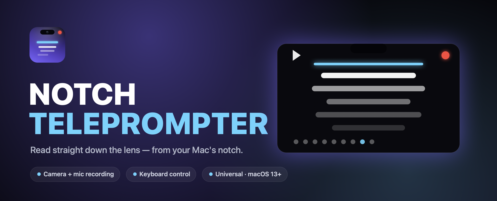
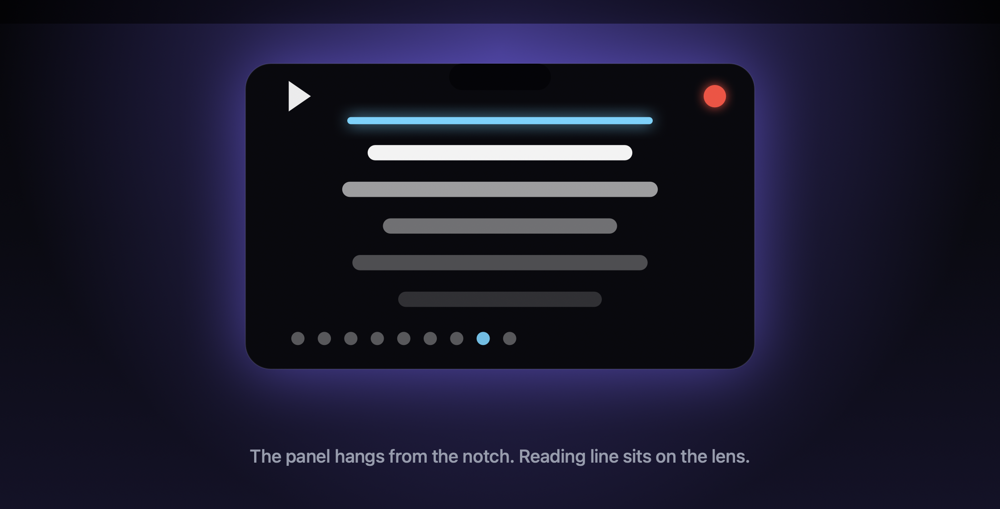

<p align="center">
  
</p>

<h1 align="center">Notch Teleprompter</h1>

<p align="center">
  <b>Read straight down the lens — right from your Mac's notch.</b><br>
  A sleek, native macOS teleprompter that hangs from the notch, with built‑in camera recording.
</p>

<p align="center">
  <a href="https://github.com/jaschahuisman/mac-notch-teleprompter/releases/latest">
    </a>
  
  
  
</p>

---

<p align="center">
  
</p>

<p align="center"><i>The reading line sits right under the notch — level with the camera — so it looks like you're talking straight to your audience.</i></p>

## Why it's different

Most teleprompters are a separate window you stare *down* at, breaking eye contact with the camera. Notch Teleprompter docks to the **notch itself** and keeps the active line **right next to the lens**, so your gaze stays on camera while you read.

| | |
|---|---|
| 🎯 **Eye‑line reading** | The current line scrolls through a guide tucked under the notch, millimetres from the camera. |
| 🎬 **Built‑in recording** | One tap records you through the camera + mic and saves a `.mov` to any folder you pick. |
| ⌨️ **Hands‑free control** | Drive everything from the keyboard — you're standing at the camera, not the trackpad. |
| 🪶 **Native & tiny** | Pure SwiftUI/AppKit. No Electron, no browser, ~250 KB download. |
| 🧠 **Remembers you** | Script, speed, font size and save folder persist between launches. |
| 💻 **Runs everywhere** | Universal binary for Apple Silicon **and** Intel, macOS 13+. Works with or without a physical notch. |

## Install

1. Download **`NotchTeleprompter.zip`** from the [**latest release**](https://github.com/jaschahuisman/mac-notch-teleprompter/releases/latest).
2. Unzip and drag **Notch Teleprompter.app** into `/Applications`.
3. It's open‑source and **not notarized by Apple**, so Gatekeeper blocks it the first time. Open it once with **either**:
   - **Right‑click** the app → **Open** → **Open**, or
   - Terminal:
     ```bash
     xattr -dr com.apple.quarantine "/Applications/Notch Teleprompter.app"
     ```
4. On first record, macOS asks for **Camera** and **Microphone** access — click **Allow**. (Screen Recording permission is never requested.)

## Using it

The panel docks at the top of the screen, fused to the notch. Primary controls flank the notch; everything else lives in a toolbar along the bottom, out of your eye‑line.

**Flanking the notch**
- ▶︎ / ⏸ (left) — play / pause scrolling
- ⏺ (right) — record yourself (red dot → stop square, with a live timer)

**Bottom toolbar** — restart · scroll speed · font size · camera preview · edit script · choose save folder · reveal last clip in Finder · collapse to notch · quit.

### Keyboard shortcuts

| Key | Action | | Key | Action |
|---|---|---|---|---|
| `Space` / `Return` | Play / pause | | `+` / `−` | Larger / smaller text |
| `R` | Start / stop recording | | `⌘E` | Edit script |
| `↑` / `↓` | Faster / slower | | scroll wheel | Scrub by hand |

Recordings save as `Teleprompter_YYYY-MM-DD_HH-mm-ss.mov`. Quitting mid‑recording finalizes the file cleanly before the app exits.

## Build from source

Requires the Swift toolchain (Command Line Tools or Xcode). No Xcode project needed.

```bash
git clone https://github.com/jaschahuisman/mac-notch-teleprompter.git
cd mac-notch-teleprompter
./build.sh release          # build + bundle a .app in dist/
open "dist/Notch Teleprompter.app"
```

- `./package.sh` builds a **universal** (arm64 + x86_64) `.app` and zips it for release.
- `swift tools/makeart.swift` regenerates the app icon and marketing graphics in `assets/`.
- `swift run` does a quick dev launch without bundling.

## How it works

- **Windowing** — a borderless, shadowless `NSWindow` at `.statusBar` level, anchored top‑center, with a shape that's square at the top (to meet the notch) and rounded at the bottom — no outline, so it reads as an extension of the notch. Notch width/height come from `NSScreen.safeAreaInsets` / `auxiliaryTop*Area`; controls leave a gap for the camera, and non‑notch Macs get a centered top bar.
- **Scrolling** — a 60 Hz timer advances the script offset (points/second). The reading guide is fixed near the top next to the lens; the script scrolls up through it and stops once the last line arrives. Keyboard and scroll‑wheel input are handled by app‑level `NSEvent` monitors.
- **Recording** — `AVCaptureSession` (camera + mic) → `AVCaptureMovieFileOutput`, written straight to your chosen folder, finalized safely on quit.

## Project layout

```
Sources/NotchTeleprompter/
  main.swift              entry point · NSWindow · menu · keyboard/scroll monitors
  TeleprompterModel.swift state · scroll clock · persistence · window layout
  Recorder.swift          AVFoundation camera/mic capture → .mov
  CameraPreview.swift      live preview layer
  ContentView.swift        SwiftUI panel · controls · scrolling text
Resources/                Info.plist · entitlements · AppIcon.icns
tools/makeart.swift       icon + marketing art generator
build.sh · package.sh     bundle / universal‑release scripts
```

---

<p align="center"><sub>Built with Swift + AppKit + AVFoundation · made for people who'd rather look at the camera.</sub></p>
